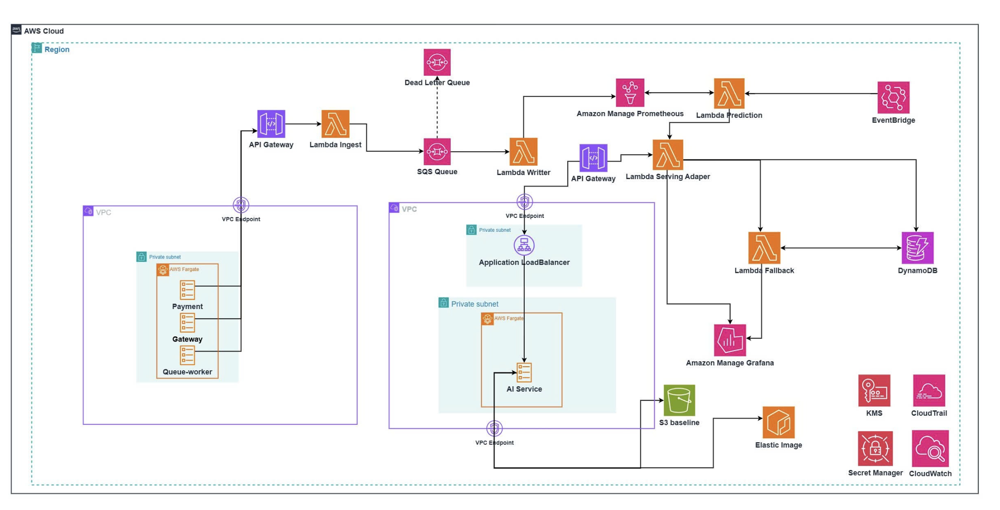

# Thiết kế hạ tầng - Task Force 4 · CDO08

**Document owner:** CDO08

**Status:** Final draft for W12 Evidence Pack #2

**Last updated:** 2026-07-01

## 1. Tổng quan kiến trúc

> **Sơ đồ kiến trúc W12:** diagram dưới đây là topology cuối của CDO08: k6 ECS generator trong workload VPC, ingest API Gateway/Lambda/SQS/Writer, AMP, Prediction/Serving Adapter/Fallback Lambdas, AI API Gateway `AWS_IAM` qua VPC Link tới internal ALB trong AI VPC, AI Engine ECS Fargate private subnet, S3 baseline, Grafana annotation và DynamoDB audit.

CDO08 thiết kế platform theo nguyên tắc **operational trust**: telemetry phải được kiểm tra trước khi lưu; lỗi tạm thời không được làm mất event âm thầm; kết quả prediction phải truy vết được; và khi AI serving lỗi, alert vẫn hoạt động theo static threshold. Đây là cách giải trực tiếp vấn đề của Client: nội bộ không được phát hiện capacity exhaustion sau support ticket.

Luồng dữ liệu final gồm sáu bước. 
Đầu tiên, một ECS Fargate task chạy synthetic generator/k6 để tạo metric cho ba service và bốn scenario test. Tiếp theo, API Gateway và Lambda ingest xác thực schema, `tenant_id`, `service_id`, `metric_type`, `ts` và value. Event hợp lệ vào SQS; event sai schema vào DLQ để điều tra. Writer Lambda lấy event theo batch từ SQS, chuyển JSON telemetry thành Prometheus remote-write payload rồi ghi vào Amazon Managed Service for Prometheus (AMP). EventBridge Scheduler chạy theo lịch, gửi payload `tenant_id`, `service_id` và metric lookback window tới Prediction Integration Lambda. Lambda query metric window tối thiểu 120 phút bằng PromQL theo service, chuyển dữ liệu thành `signal_window`, sau đó gọi `POST /v1/predict` tới **AI Engine Runtime do CDO08 host** qua AI API Gateway `AWS_IAM` bằng IAM SigV4. AI team bàn giao engine artifact/spec; CDO08 triển khai runtime theo Deployment Contract, kiểm soát network, IAM, secrets, scaling, health check, rollout/rollback và observability trong platform CDO08. Nếu thành công, Lambda tạo Grafana annotation, ghi audit record và publish SNS email alert khi anomaly vượt ngưỡng; nếu AI trả 429/503, timeout hoặc hết retry budget, fallback evaluator query metric gần nhất từ AMP, dùng static threshold và tạo alert/annotation/email có nhãn `fallback`.

> **Trạng thái quyết định AI Engine:** Deployment Contract đã freeze lại theo đúng ownership: **mỗi CDO tự host AI Engine trên platform của mình** dựa trên artifact/spec AI bàn giao. CDO08 dùng ECS Fargate FastAPI runtime, internal ALB private path, API Gateway `AWS_IAM` SigV4 edge và baseline files trên S3.

> **Dashboard note:** generator/writer hiện ingest đủ 7 metric theo contract, gồm `active_connections`. Grafana dashboard W12 đã có panel riêng cho 7 metric: CPU, memory, active connections, DB connection pool, queue depth, cache hit rate và API latency.

CDO08 không chọn một “angle công nghệ” chỉ để khác hai CDO còn lại. Nhóm có thể dùng managed service giống họ, nhưng cần chứng minh platform đáng tin hơn bằng test và artifact: validation/retry/DLQ, correlation ID xuyên suốt, audit mã hóa, fallback test thật, IaC tái lập và cost guard.

## 2. Lựa chọn thành phần

| Thành phần | Lựa chọn của CDO08 | Trách nhiệm | Lý do chọn | Kiểm soát chi phí |
|---|---|---|---|---|
| Synthetic workload | ECS Fargate task chạy generator/k6 | Tạo normal baseline, gradual drift, sudden spike, slow leak, noisy baseline cho 3 service | Chạy được test liên tục ≥2 giờ, tái lập được và không phụ thuộc laptop cá nhân | Chỉ chạy trong test window; giới hạn task count, CPU và memory |
| Telemetry entry | API Gateway + Lambda ingest | Nhận event, kiểm tra schema/whitelist, gắn correlation ID | Managed HTTP entry; có điểm kiểm soát trước khi dữ liệu vào storage | Request-size limit, throttling, không giữ compute luôn chạy |
| Buffer | Amazon SQS Standard + DLQ | Tách producer khỏi writer, giữ event khi writer/storage lỗi | Có retry, queue-age và DLQ evidence; tránh mất telemetry im lặng | Retention vừa đủ demo, CloudWatch alarm khi DLQ tăng |
| Telemetry writer | Lambda đọc SQS theo batch, đóng vai Prometheus remote-write adapter | Chuyển JSON telemetry thành Prometheus metric name từ `metric_type` + labels, remote-write vào AMP; xử lý retry từng record | Event-driven, scale theo backlog; giữ validation/buffer hiện có | Giới hạn concurrency/batch; POC remote-write trước khi lock (§5.4) |
| Primary telemetry store | Amazon Managed Service for Prometheus (AMP) | Lưu/query metric theo PromQL và retention ≥90 ngày | AMP managed, phù hợp infra metrics và Grafana; Timestream không khả dụng cho account mới | Retention mặc định 150 ngày; kiểm soát label cardinality, ingest/query volume và cost |
| Prediction trigger | Amazon EventBridge Scheduler | Trigger Prediction Integration Lambda theo lịch, tách prediction cadence khỏi telemetry ingest rate | AI không bị gọi theo từng metric; cadence ổn định để đo lead time/cost | 3 schedule nhỏ, chỉ chạy mỗi 5 phút; không dùng DLQ riêng, dùng CloudWatch alarm cho invoke failure |
| AI Engine Runtime | ECS Fargate FastAPI service do CDO08 host | Nhận `POST /v1/predict`, detect anomaly và trả recommendation | CDO08 host model serving theo artifact/spec AI bàn giao; dùng AI API Gateway `AWS_IAM` làm SigV4 edge, VPC Link tới internal Application Load Balancer trong private subnet, AI task trong private subnet | CDO08 chịu cost/runtime engine; min/max task, autoscaling và scale-to-zero/cost breaker cần kiểm soát |
| AI integration | Prediction integration Lambda | Query PromQL window ≥120 phút từ AMP, map metric thành `signal_window`, gọi AI API Gateway `/v1/predict` bằng SigV4, lưu outcome và tạo annotation | Bounded event-driven workload; adapter cô lập AI Engine khỏi PromQL/endpoint details | Timeout/retry/circuit breaker rõ; cap concurrency và query window |
| Fail-open | Fallback evaluator Lambda | So sánh static threshold khi AI lỗi | Đáp ứng hard requirement fail-open, tách rõ model result với fallback result | Chỉ chạy khi dependency AI lỗi |
| Dashboard overlay | Amazon Managed Grafana | Dashboard metric và annotation prediction/fallback | Dùng Grafana có sẵn theo brief; annotation API hỗ trợ tag/filter theo service | Chỉ tạo workspace/user cần cho demo |
| Email alert | SNS Topic + email subscription | Gửi prediction/fallback alert ra email PM khi anomaly vượt ngưỡng | Tách notification khỏi AI Engine, dễ demo và dễ thay bằng Slack/PagerDuty sau này | Người nhận phải confirm subscription; dùng cooldown để tránh spam prediction |
| Audit store | DynamoDB SSE-KMS, TTL | Lưu mỗi prediction/fallback call, query theo correlation ID | Query audit nhanh và tách audit khỏi telemetry; TTL hỗ trợ retention | On-demand trong capstone; TTL xóa record quá hạn |
| Secrets/encryption | Secrets Manager + KMS; AMP encryption at rest mặc định | Giữ token Grafana và runtime config AI Engine; AI auth dùng IAM SigV4 nên không dùng API key | Không để credential trong source/log; audit và data store có boundary rõ | Chỉ dùng AMP CMK nếu security requirement cần, vì tăng IAM/KMS complexity |
| Observability | CloudWatch Logs, Metrics, Alarms | Theo dõi ingest error, DLQ, writer, AI dependency, fallback và latency | Evidence cho reliability và hỗ trợ debug nhanh | Retention log rõ, structured log, tránh debug log volume cao |

## 3. Trọng tâm cạnh tranh của CDO08

CDO08 cần được AI/mentor chọn dựa trên kết quả đo, không dựa vào việc “dùng service A thay service B”. Claim của nhóm phải luôn theo format: **target → cách test → raw artifact → kết quả đo**. Trong W11, nhóm chốt target và dựng instrumentation; W12 mới ghi actual result vào test/eval report.

| Trục so sánh | CDO08 cần chứng minh | Artifact bắt buộc |
|---|---|---|
| Độ tin cậy telemetry | Event không bị mất âm thầm; event invalid/retryable đo được | API validation count, SQS backlog/age, DLQ count, writer success/error, sample replay |
| Truy vết E2E | Một prediction truy ngược được telemetry window và đi xuôi được tới Grafana/audit | Correlation ID trong log, API response, annotation và DynamoDB audit record |
| Cảnh báo dự báo | Annotation có service, drift, confidence, action, from→to và evidence link | Contract fixture và ảnh/dashboard query thật |
| Fail-open | AI timeout/503 vẫn tạo static-threshold alert có nhãn riêng | Test injected failure, timestamp, Grafana annotation, audit `fallback=true` |
| Security/isolation | Không đọc/ghi chéo service hoặc tenant | IAM negative test, payload mismatch test, KMS config, log redaction evidence |
| Khả năng vận hành | Reviewer deploy lại được và hiểu failure mode | Terraform plan/apply, smoke test, runbook, dashboard alarm |
| Chi phí | Có forecast dưới $200/tháng và cơ chế bảo vệ budget | Cost model, resource tags, budget alert/circuit-breaker screenshot |

Trọng tâm này có trade-off: CDO08 không ưu tiên auto-remediation, active-active multi-region, dashboard UI mới hay tenant provisioning SaaS. Những phần đó ngoài scope hoặc khó chứng minh trong hai tuần. Thời gian được dành cho test 4 scenario, window ≥2 giờ, security evidence và đường fallback.

## 4. Multi-service và logical tenant isolation

### 4.1 Mô hình dữ liệu

Mọi telemetry event phải có tối thiểu các field sau: `tenant_id`, `service_id`, `metric_type`, `ts`, `value`, `labels`, `schema_version` và `correlation_id`. `metric_type` là tên metric trong Telemetry Contract và là field mà AI API nhận trong `signal_window`. Capstone test tối thiểu ba service: `payment-gw`, `ledger` và `fraud-detector`; metric bắt buộc theo contract gồm `cpu_usage_percent`, `memory_usage_percent`, `active_connections`, `db_connection_pool_pct`, `queue_depth`, `cache_hit_rate_pct` và `api_latency_ms`.

`tenant_id` được giữ trong schema để chứng minh logical isolation. Client cần xác nhận nó là customer/account isolation hay chỉ là service isolation. Dù định nghĩa cuối là gì, ingest Lambda bắt buộc kiểm tra `X-Tenant-Id` khớp với payload. Mismatch bị reject và audit; event không được ghi vào primary telemetry store.

### 4.2 Pattern isolation

- **Data isolation:** dùng AMP workspace dùng chung; `metric_type` trở thành Prometheus metric name, còn `tenant_id`, `service_id` và `region` là labels bắt buộc. Query builder chỉ sinh PromQL theo pair đã được xác thực; không nhận PromQL/filter fragment tự do từ caller. Prometheus labels là cơ chế phân loại/query, không tự tạo authorization boundary; IAM và API validation vẫn phải enforce access.
- **Audit isolation:** DynamoDB partition key theo `tenant_id#service_id`; `correlation_id` là indexed attribute để điều tra E2E. Reader role chỉ có quyền query đường truy cập được phê duyệt.
- **Compute isolation:** Lambda dùng shared compute để giữ chi phí thấp, nhưng IAM role được tách theo nhiệm vụ: generator chỉ gửi telemetry, writer chỉ ghi telemetry, integration mới được invoke AI/write audit/create annotation.
- **Lý do:** pooled model đủ cho ba service demo, dễ vận hành và vẫn tạo được evidence isolation. Per-tenant account/container không phù hợp timeline/cost capstone.

### 4.3 Onboarding service

CDO08 không build public onboarding API. Thay vào đó, một config-driven onboarding flow được versioned trong repo: thêm service/tenant config, metric whitelist, baseline window và static threshold; deploy Terraform/config; chạy baseline generator; kiểm tra ingest → query → mock prediction → annotation → audit. Chỉ đánh dấu service ready khi correlation lookup thành công. Cách này thực tế hơn cho scope capstone và tái lập được cho service thứ ba.

### 4.4 Noisy neighbor mitigation

- API Gateway throttling và Lambda max concurrency giới hạn một producer bất thường.
- SQS hấp thụ burst; queue age và DLQ depth là alarm bắt buộc.
- Event size và metric whitelist bị kiểm tra trước khi buffer.
- Prediction integration có cooldown/rate limit theo service để một noisy series không chiếm toàn bộ model capacity.
- k6 report phải phân tách throughput, latency và error theo service thay vì chỉ tổng aggregate.

## 5. Alternatives considered - đầy đủ theo từng thành phần

Phần này **không bổ sung component mới**. Nó so sánh các implementation cho từng component đã có trong §2, để CDO08 có thể phản biện công bằng nếu đội khác dùng service khác. “Không chọn” không đồng nghĩa “service đó tệ”; mỗi option có điều kiện phù hợp riêng. Lựa chọn cuối của CDO08 ưu tiên hoàn thành E2E có evidence trong hai tuần và dưới cost cap.

### 5.1 Synthetic workload

| Option | Điểm mạnh | Trade-off / khi đội khác chọn sẽ hợp lý | Quyết định CDO08 |
|---|---|---|---|
| ECS Fargate task chạy generator/k6 | Chạy liên tục ≥2 giờ, không phụ thuộc laptop, có image/version/load profile tái lập | Có startup/fixed test cost; cần build container | **Chọn.** Test window TF4 ≥2 giờ và load profile là artifact cần nộp. |
| Lambda generator | Rất nhẹ cho event burst ngắn | Bị giới hạn runtime, không phù hợp một scenario chạy ≥2 giờ | Không chọn cho generator; hợp lý nếu chỉ seed data ngắn. |
| EC2 tự quản | Tự do tooling, dễ SSH debug | Phải patch/terminate, có nguy cơ quên tắt gây cost | Không chọn trong capstone; hợp lý khi cần agent/tooling không chạy được trên Fargate. |

### 5.2 Telemetry entry

| Option | Điểm mạnh | Trade-off / khi đội khác chọn sẽ hợp lý | Quyết định CDO08 |
|---|---|---|---|
| API Gateway + Lambda ingest | Có HTTP boundary, throttling, schema validation, auth và log độc lập | Thêm request hop, có Lambda cold-start | **Chọn.** CDO08 cần chứng minh event invalid bị reject trước storage. |
| ALB + ECS/Fargate collector | Process lâu dài, library/protocol linh hoạt | Always-on cost và vận hành service | Hợp lý nếu ingest cần connection lâu dài hoặc custom protocol. |
| Generator ghi trực tiếp TSDB/remote-write | Ít component, latency thấp nhất | Không có central validation/auth/retry boundary; producer chịu lỗi storage | Không chọn vì yếu về audit/failure evidence; chỉ hợp lý cho demo tối giản. |

### 5.3 Buffer và xử lý event lỗi

| Option | Điểm mạnh | Trade-off / khi đội khác chọn sẽ hợp lý | Quyết định CDO08 |
|---|---|---|---|
| SQS Standard + DLQ | Managed queue, retry/replay rõ, phù hợp decouple ingest-writer | At-least-once delivery nên writer phải idempotent; không đảm bảo strict ordering | **Chọn.** Bài toán cần tránh mất telemetry im lặng và có evidence retry/DLQ. |
| Kinesis Data Streams | Throughput streaming, shard ordering, nhiều consumer realtime | Shard/capacity/cost phức tạp hơn; cần chứng minh volume thực tế | Hợp lý nếu test thật sự cần sustained throughput/ordering cao. |
| Không dùng buffer | Ít service nhất | Storage/writer lỗi làm producer mất hoặc block event | Không chọn vì trực tiếp mâu thuẫn mục tiêu reliability của CDO08. |

### 5.4 Telemetry writer

| Option | Điểm mạnh | Trade-off / khi đội khác chọn sẽ hợp lý | Quyết định CDO08 |
|---|---|---|---|
| Lambda đọc SQS theo batch, remote-write AMP | Scale theo backlog, pay-per-use, giữ validation/buffer; chỉ thay adapter ghi store | Cần POC Prometheus remote-write encoding, compression, SigV4 và quota | **Chọn có điều kiện.** Giữ kiến trúc hiện tại nếu POC pass. |
| ECS/Fargate consumer với ADOT Collector/Prometheus Agent | Dùng collector chuẩn cho Prometheus remote-write và có process ổn định | Always-on cost, thêm container/config/ops | Fallback option nếu remote-write từ Lambda không ổn định hoặc khó implement kịp. |
| Kinesis Data Firehose | Managed delivery, ít code writer | Không phù hợp trực tiếp remote-write AMP và ít linh hoạt cho correlation/transform | Không chọn cho AMP path. |

### 5.5 Primary telemetry store

| Option | Điểm mạnh | Trade-off / khi đội khác chọn sẽ hợp lý | Quyết định CDO08 |
|---|---|---|---|
| Amazon Timestream for LiveAnalytics | Managed time-series query và lifecycle tốt | Account capstone là new customer, AWS Console chặn truy cập | **Rejected.** Không triển khai được trên account hiện tại. |
| Amazon Managed Service for Prometheus (AMP) | Managed Prometheus, PromQL, Grafana integration, retention mặc định 150 ngày | Cần remote-write adapter, label-cardinality/cost/quota guardrails | **Chọn.** POC Writer → AMP, PromQL và Grafana (§5.4) là gate trước base-infra freeze. |
| InfluxDB/Prometheus tự quản trên ECS/EKS | Toàn quyền plugin/query/retention | Persistent volume, backup, patching, HA là gánh nặng W11–W12 | Không chọn do operational overhead; hợp lý với team đã có platform vận hành sẵn. |
| S3 + Athena | Rẻ cho archive/analytics batch | Không đáp ứng primary time-series query requirement của TF4 | Không dùng làm primary store; có thể dùng làm archive ngoài scope. |

### 5.6 Prediction trigger

| Option | Điểm mạnh | Trade-off / khi đội khác chọn sẽ hợp lý | Quyết định CDO08 |
|---|---|---|---|
| EventBridge Scheduler → Prediction Integration Lambda | Chạy theo rate/cron, có payload per service, không gắn prediction rate vào ingest rate | Scheduler chỉ chịu trách nhiệm kích hoạt theo lịch; nếu invoke fail thì phát hiện bằng CloudWatch alarm, không lưu schedule event vào DLQ riêng | **Chọn.** Ba schedule mỗi 5 phút, lệch nhau 1–2 phút; flexible time window tắt để lead-time measurement nhất quán. Không dùng DLQ riêng cho Scheduler trong scope W11/W12. |
| EventBridge Event Bus | Phù hợp route event theo rule/pattern từ nhiều nguồn | Không tự tạo cadence prediction; thêm event routing không cần thiết cho scope hiện tại | Không chọn W11; chỉ cân nhắc nếu cần trigger prediction theo business/ops event trong tương lai. |
| SQS telemetry event trigger Prediction Lambda | Gần real-time, ít thêm service | Gọi AI theo từng metric/batch, dễ quá tải AI, tốn cost và tạo prediction trùng lặp | Không chọn; SQS chỉ trigger Writer telemetry. |

Mỗi schedule gửi payload gồm `tenant_id`, `service_id`, `lookback_minutes` và `scheduled_at`. Prediction Integration Lambda dùng `service_id + scheduled_at` làm idempotency key/audit context để retry không tạo prediction annotation trùng.

CDO08 **không dùng DLQ riêng cho EventBridge Scheduler** ở giai đoạn này. Lý do: prediction là job định kỳ và có thể tính lại trên window mới; nếu một lần trigger bị miss thì lần schedule kế tiếp vẫn có thể chạy tiếp. Rủi ro chính của TF4 không phải mất một scheduled event, mà là mất telemetry hoặc ghi sai baseline. Vì vậy DLQ được ưu tiên cho telemetry ingestion path. Với Scheduler, CDO08 dùng CloudWatch metric/alarm cho invoke failure, Lambda error, timeout và fallback rate để phát hiện lỗi vận hành.

### 5.7 AI Engine Runtime — CDO08-hosted model serving

AI team chịu trách nhiệm bàn giao engine logic/artifact và deployment specification. CDO08 chịu trách nhiệm host phần model serving trên platform của mình. Runtime theo contract hiện tại là ECS Fargate stateless FastAPI, port 8080, health path `/health`, path `/v1/predict`, auth IAM SigV4, baseline storage trên S3 mã hóa KMS và manual baseline refresh hằng tuần.

| Trạng thái | Điều đã chốt | Điều CDO08 phải làm | Evidence |
|---|---|---|---|
| Ownership | CDO08 host model serving; AI bàn giao artifact/spec | Deploy ECS Fargate service trong private subnet, internal Application Load Balancer trong private subnet, health check, scaling, rollback bằng CodeDeploy/ECS task definition | Terraform/deploy evidence |
| Network | ALB là internal ingress trong AI VPC; AI task vẫn nằm private | Serving Adapter Lambda gọi AI API Gateway `AWS_IAM` bằng SigV4; API Gateway đi qua VPC Link tới internal ALB | Connectivity smoke test |
| Auth | IAM SigV4; `X-Tenant-Id` bắt buộc | Cấu hình role/policy `execute-api:Invoke` để gọi `/v1/predict`, reject khi thiếu/sai SigV4 hoặc tenant mismatch | Auth success/denied test |
| Request | `signal_window` phải có ≥120 phút dữ liệu; metric dùng `metric_type`; header `X-Tenant-Id` bắt buộc | Query AMP, forward-fill/zero-fill bucket thiếu trước khi gọi AI, không gửi PII trong labels | Contract fixture + 400/422 negative test |
| Rate limit | AI API limit 600 requests/min per tenant, global 6000 requests/min; `429` có `Retry-After` | Cap concurrency/schedule cadence; exponential backoff 1s → 2s → 4s rồi fallback nếu hết budget | 429 injected test |

Trong W11, nếu artifact AI thật chưa sẵn sàng, Prediction Lambda có thể gọi mock container/endpoint cùng contract để hoàn thành đường AMP → request → annotation/audit/fallback. Mock không phải bằng chứng tích hợp AI thật; W12 phải thay mock bằng image/artifact AI thật và chạy smoke test thật trên ECS Fargate của CDO08.

### 5.8 AI integration adapter

| Option | Điểm mạnh | Trade-off / khi đội khác chọn sẽ hợp lý | Quyết định CDO08 |
|---|---|---|---|
| Lambda adapter | Xử lý ngắn theo event, dễ mock rồi đổi config sang AI Engine Runtime thật, timeout/retry rõ | Cold-start; phải cap concurrency để không làm overload engine | **Chọn.** Đúng dependency boundary của API contract. |
| ECS/Fargate integration service | Connection pooling, process luôn sẵn, library linh hoạt | Fixed cost và vận hành service dù call không liên tục | Hợp lý nếu AI API QPS cao/streaming hoặc P99 cold-start fail target. |
| Step Functions orchestration | Visual retry/stateful workflow | Thêm service/latency/cost, quá nặng cho một prediction call | Không chọn; hợp lý nếu flow approval có nhiều bước ngoài scope. |

### 5.9 Fail-open static threshold

| Option | Điểm mạnh | Trade-off / khi đội khác chọn sẽ hợp lý | Quyết định CDO08 |
|---|---|---|---|
| Lambda fallback evaluator | Dùng cùng correlation/audit/annotation path, threshold per service, test được API failure | Cần tự quản config threshold | **Chọn.** Đáp ứng fail-open và tạo artifact E2E nhất quán. |
| CloudWatch Alarm trực tiếp | Managed alert nhanh, ít code | Khó gắn đủ context recommendation/correlation vào cùng prediction flow | Hợp lý làm safety net bổ sung hoặc nếu Client chỉ cần alarm threshold. |
| Không fallback | Kiến trúc đơn giản nhất | AI down đồng nghĩa không alert; fail hard requirement | Loại. |

### 5.10 Dashboard overlay

| Option | Điểm mạnh | Trade-off / khi đội khác chọn sẽ hợp lý | Quyết định CDO08 |
|---|---|---|---|
| Amazon Managed Grafana + annotation API | Đúng yêu cầu embed Grafana; annotation có tag/filter và evidence link | Cần workspace/token/provisioning | **Chọn.** Hiển thị prediction/fallback trên dashboard hiện có. |
| Grafana tự quản trên ECS/EKS | Toàn quyền plugin/database | Vận hành/patching/persistent state tăng scope | Hợp lý nếu nhóm đã có Grafana stack sẵn và cần plugin đặc thù. |
| CloudWatch Dashboard/Alarm chỉ dùng AWS native | Ít service, tích hợp metric/alarm tốt | Không đáp ứng rõ yêu cầu Grafana annotation overlay | Không chọn làm dashboard chính; có thể là nguồn metric/alarm phụ. |

### 5.11 Audit store

| Option | Điểm mạnh | Trade-off / khi đội khác chọn sẽ hợp lý | Quyết định CDO08 |
|---|---|---|---|
| DynamoDB SSE-KMS + TTL | Query theo correlation/service nhanh, serverless, retention qua TTL | Không tối ưu báo cáo SQL phức tạp; TTL không phải deletion đúng thời điểm | **Chọn.** Audit access pattern chủ yếu là tra một prediction/fallback. |
| Aurora/RDS | SQL/query/reporting linh hoạt, transaction mạnh | Always-on cost, connection/backup/ops cao cho capstone | Hợp lý nếu Client cần audit reporting/joins phức tạp. |
| CloudWatch Logs / S3 log files | Ghi log dễ, rẻ/retention linh hoạt | Khó bảo đảm audit schema/query theo correlation và access control nghiệp vụ | Không chọn làm audit system chính; vẫn dùng CloudWatch cho operational logs. |

### 5.12 Secrets và encryption

| Option | Điểm mạnh | Trade-off / khi đội khác chọn sẽ hợp lý | Quyết định CDO08 |
|---|---|---|---|
| Secrets Manager + customer-managed KMS key | Quản lý secret riêng, policy/audit rõ; kiểm soát key cho audit/storage | Có chi phí quản lý secret/key và cần IAM policy cẩn thận | **Chọn.** Phù hợp yêu cầu audit/encryption evidence. |
| SSM Parameter Store SecureString + KMS | Đơn giản/chi phí thấp cho config-secret ít thay đổi | Secret lifecycle/rotation workflow ít chuyên biệt hơn | Hợp lý nếu secret rất ít, static và cost là ưu tiên cao nhất. |
| Environment variable/plain config | Dễ demo nhanh | Rủi ro lộ secret trong repo/log/deploy config | Loại; không đạt security baseline. |

### 5.13 Observability platform

| Option | Điểm mạnh | Trade-off / khi đội khác chọn sẽ hợp lý | Quyết định CDO08 |
|---|---|---|---|
| CloudWatch Logs, Metrics, Alarms + Amazon Managed Grafana | Native AWS metrics/alarm cho Lambda/SQS; Grafana là lớp trình bày chung | Có CloudWatch cho platform health và AMP cho telemetry time-series | **Chọn cùng AMP.** CloudWatch chứng minh ingest/DLQ/fallback; Grafana query AMP và hiển thị annotation. |
| AMP + Grafana chỉ dùng Prometheus alert/query | PromQL và dashboard thống nhất | Không thay thế CloudWatch metrics/logs cho Lambda/SQS/DLQ debugging | Không chọn độc lập; AMP bổ sung, không thay CloudWatch operational observability. |
| OpenTelemetry tracing đầy đủ | Trace quan hệ service rất tốt | Instrumentation/collector/trace backend tăng scope, không phải hard requirement | Không chọn W11; có thể là future work nếu correlation ID không đủ. |

## 6. Scaling strategy

- **Ingest Lambda:** API Gateway throttle và reserved/max concurrency ngăn một source làm cạn account concurrency. Throttling/reject được đo bằng metric.
- **Writer Lambda:** scale theo SQS backlog; cấu hình batch size, max concurrency và partial batch response. Writer remote-write AMP với timeout/retry giới hạn; alarm theo queue age, visible messages, DLQ depth và remote-write error/duration.
- **Prediction trigger:** ba EventBridge schedules chạy mỗi 5 phút nhưng lệch nhau 1–2 phút. Payload mang service/window; flexible time window tắt. Không dùng DLQ riêng cho Scheduler; CloudWatch alarm theo Scheduler invoke failure, Lambda error/timeout và fallback rate.
- **Prediction integration:** cap concurrency; timeout/retry budget hữu hạn; circuit breaker route sang fallback để tránh retry storm.
- **AI Engine Runtime:** CDO08 host ECS Fargate theo contract: min 2/max 4, CPU 512, memory 1024 MB, AI API Gateway `AWS_IAM`, VPC Link tới internal Application Load Balancer, AI task trong private subnet, SigV4 edge enforcement và `/health`. CDO08 phải cap concurrency của Prediction Lambda, tôn trọng `429 Retry-After`, giữ request rate thấp hơn 600 requests/min per tenant, và không để retry storm làm quá tải engine.
- **AMP:** chỉ query PromQL theo `service_id`, `tenant_id`, metric name và window ≥120 phút đúng contract. Dashboard variable phải giữ label filters; ghi query duration, ingest volume và active-series/cardinality cho performance/cost analysis.
- **Generator:** Fargate task count cố định mỗi run; k6 ramp profile versioned để cả nhóm dùng cùng load profile khi so sánh.

## 7. Failure modes và recovery

| Failure | Detection | Recovery | RTO capstone | RPO |
|---|---|---|---:|---:|
| Telemetry sai schema | Validation metric/log | Reject, log correlation ID; sửa rồi replay generator event | Ngay lập tức | Không nhận event invalid |
| Writer/AMP remote-write lỗi tạm thời | Lambda remote-write error, queue age | SQS retry; writer xử lý lại sau khi AMP hồi phục; repeated failure vào DLQ | <15 phút target | Event còn trong SQS retention |
| Scheduler không invoke được Prediction Lambda | EventBridge Scheduler invocation failure metric và CloudWatch alarm | Điều tra permission/target/throttle; prediction sẽ chạy lại ở lần schedule kế tiếp trên window mới; không dùng prediction-schedule DLQ trong scope hiện tại | <15 phút target | Không lưu scheduled payload; telemetry gốc vẫn còn trong AMP |
| Prediction Lambda execution lỗi | Lambda error/on-failure destination | Alert, audit error; retry/idempotency theo Lambda policy, không tạo annotation trùng | <15 phút target | Audit/error evidence giữ lại |
| AI Engine Runtime không healthy/rollout lỗi | HTTP 503/429/timeout, ECS health check, engine latency/error metric | Prediction Lambda dùng bounded retry rồi fallback static threshold; CDO08 rollback ECS service/image theo deployment runbook, báo AI owner nếu lỗi do artifact/model | <1 phút alert path | Telemetry giữ lại; prediction model unavailable |
| Poison event | Receive count/DLQ alarm | Điều tra, sửa transform/schema, replay thủ công có evidence | <30 phút target | Giữ một record lỗi trong DLQ |
| AI timeout/429/503 | Dependency error metric | Bounded retry rồi static-threshold fallback; audit `fallback=true` | <1 phút alert path | Telemetry giữ lại; prediction model unavailable |
| Grafana annotation API lỗi | Integration error/audit status | Retain audit, bounded retry; dashboard query/runbook hiển thị lỗi | <15 phút target | Audit record giữ lại |
| Audit write lỗi | Conditional write/error alarm | Retry; đánh dấu E2E incomplete, không claim scenario pass | <15 phút target | Không chấp nhận silent audit loss |
| Region outage | Health signal | Manual recovery/region switch chỉ design-only | Ngoài scope | Design-only |

## Related documents

- [`01_requirements_analysis.md`](01_requirements_analysis.md) - context, NFR và criteria cạnh tranh của CDO08
- [`03_security_design.md`](03_security_design.md) - network, IAM, KMS, secrets và isolation implementation
- [`04_deployment_design.md`](04_deployment_design.md) - Terraform, CI/CD, rollout/rollback
- [`05_cost_analysis.md`](05_cost_analysis.md) - forecast và measured cost
- [`08_adrs.md`](08_adrs.md) - ADR cho các quyết định có trade-off
